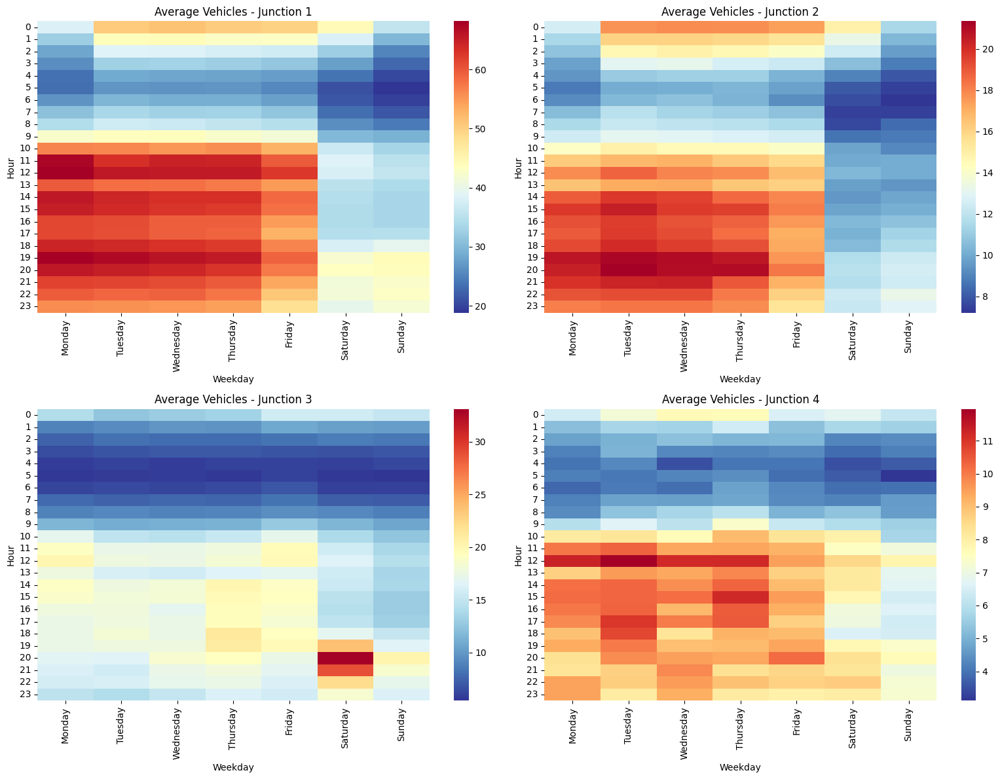
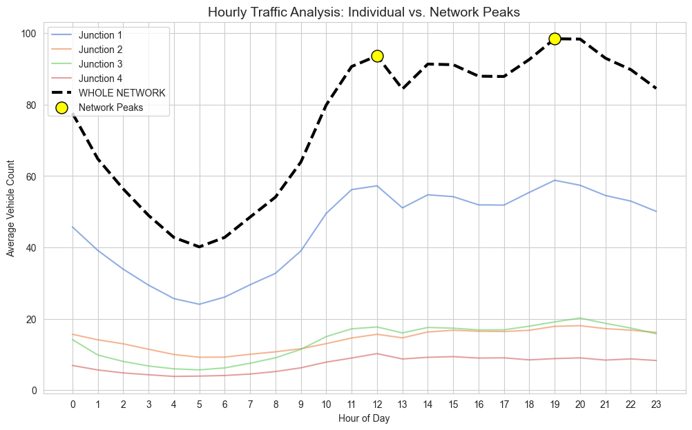
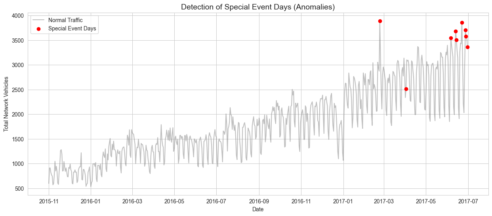
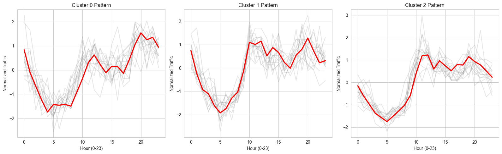
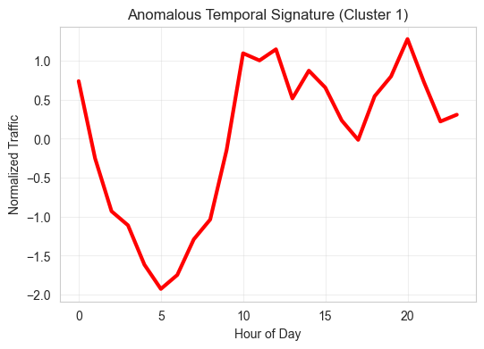
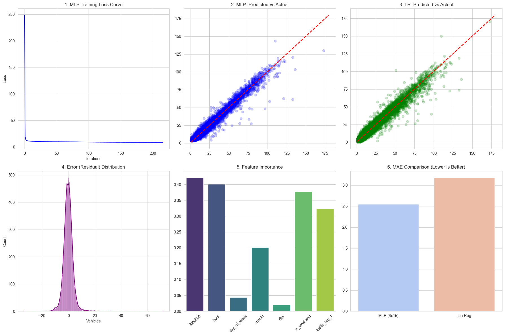

.. code:: ipython3

    import pandas as pd      # For data manipulation and tables
    import seaborn as sns    # For high-level visualization (Heatmaps)
    import matplotlib.pyplot as plt  # For basic plotting control
    import numpy as np
    import sys
    !{sys.executable} -m pip install tslearn
    import tslearn
    from tslearn.clustering import TimeSeriesKMeans
    from tslearn.preprocessing import TimeSeriesScalerMeanVariance# For mathematical operations
    
    
    print("Libraries loaded successfully!")

.. parsed-literal::

    Collecting tslearn
      Using cached tslearn-0.7.0-py3-none-any.whl.metadata (16 kB)
    Requirement already satisfied: scikit-learn>=1.4 in /Library/Frameworks/Python.framework/Versions/3.12/lib/python3.12/site-packages (from tslearn) (1.7.0)
    Requirement already satisfied: numpy>=1.24.3 in /Library/Frameworks/Python.framework/Versions/3.12/lib/python3.12/site-packages (from tslearn) (2.2.5)
    Requirement already satisfied: scipy>=1.10.1 in /Library/Frameworks/Python.framework/Versions/3.12/lib/python3.12/site-packages (from tslearn) (1.16.0)
    Collecting numba>=0.58.1 (from tslearn)
      Downloading numba-0.63.1-cp312-cp312-macosx_11_0_arm64.whl.metadata (2.9 kB)
    Requirement already satisfied: joblib>=1.2 in /Library/Frameworks/Python.framework/Versions/3.12/lib/python3.12/site-packages (from tslearn) (1.5.1)
    Collecting llvmlite<0.47,>=0.46.0dev0 (from numba>=0.58.1->tslearn)
      Downloading llvmlite-0.46.0-cp312-cp312-macosx_11_0_arm64.whl.metadata (5.0 kB)
    Requirement already satisfied: threadpoolctl>=3.1.0 in /Library/Frameworks/Python.framework/Versions/3.12/lib/python3.12/site-packages (from scikit-learn>=1.4->tslearn) (3.6.0)
    Using cached tslearn-0.7.0-py3-none-any.whl (372 kB)
    Downloading numba-0.63.1-cp312-cp312-macosx_11_0_arm64.whl (2.7 MB)
       ━━━━━━━━━━━━━━━━━━━━━━━━━━━━━━━━━━━━━━━━ 2.7/2.7 MB 842.0 kB/s  0:00:03m0:00:0100:01
    [?25hDownloading llvmlite-0.46.0-cp312-cp312-macosx_11_0_arm64.whl (37.2 MB)
       ━━━━━━━━━━━━━━━━━━━━━━━━━━━━━━━━━━━━━━━━ 37.2/37.2 MB 377.0 kB/s  0:01:20m0:00:0100:03
    [?25hInstalling collected packages: llvmlite, numba, tslearn
       ━━━━━━━━━━━━━━━━━━━━━━━━━━━━━━━━━━━━━━━━ 3/3 [tslearn]m1/3 [numba]
    Successfully installed llvmlite-0.46.0 numba-0.63.1 tslearn-0.7.0

.. parsed-literal::

    /Library/Frameworks/Python.framework/Versions/3.12/lib/python3.12/site-packages/tslearn/bases/bases.py:16: UserWarning: h5py not installed, hdf5 features will not be supported.
    Install h5py to use hdf5 features: http://docs.h5py.org/
      warn(h5py_msg)

.. parsed-literal::

    Libraries loaded successfully!

.. code:: ipython3

    df = pd.read_csv('traffic.csv')
    df.head()

.. raw:: html

    

    
    <table border="1" class="dataframe">
      <thead>
        <tr style="text-align: right;">
          <th></th>
          <th>DateTime</th>
          <th>Junction</th>
          <th>Vehicles</th>
          <th>ID</th>
        </tr>
      </thead>
      <tbody>
        <tr>
          <th>0</th>
          <td>2015-11-01 00:00:00</td>
          <td>1</td>
          <td>15</td>
          <td>20151101001</td>
        </tr>
        <tr>
          <th>1</th>
          <td>2015-11-01 01:00:00</td>
          <td>1</td>
          <td>13</td>
          <td>20151101011</td>
        </tr>
        <tr>
          <th>2</th>
          <td>2015-11-01 02:00:00</td>
          <td>1</td>
          <td>10</td>
          <td>20151101021</td>
        </tr>
        <tr>
          <th>3</th>
          <td>2015-11-01 03:00:00</td>
          <td>1</td>
          <td>7</td>
          <td>20151101031</td>
        </tr>
        <tr>
          <th>4</th>
          <td>2015-11-01 04:00:00</td>
          <td>1</td>
          <td>9</td>
          <td>20151101041</td>
        </tr>
      </tbody>
    </table>
    

.. code:: ipython3

    # Convert the 'DateTime' column to actual date/time objects
    df['DateTime'] = pd.to_datetime(df['DateTime'])
    
    # Verify the conversion
    print(df.dtypes)

.. parsed-literal::

    DateTime    datetime64[ns]
    Junction             int64
    Vehicles             int64
    ID                   int64
    dtype: object

.. code:: ipython3

    # Extract the hour (0-23)
    df['hour'] = df['DateTime'].dt.hour
    
    # Extract the day of the week (Monday=0, Sunday=6)
    df['weekday_num'] = df['DateTime'].dt.weekday
    
    # Extract the month
    df['month'] = df['DateTime'].dt.month
    
    # Extract the specific date
    df['date_only'] = df['DateTime'].dt.date
    
    # Create a binary indicator for weekends (1 if Sat/Sun, 0 if Mon-Fri)
    df['is_weekend'] = df['weekday_num'].apply(lambda x: 1 if x >= 5 else 0)
    
    # Display the updated table
    df.head()

.. raw:: html

    

    
    <table border="1" class="dataframe">
      <thead>
        <tr style="text-align: right;">
          <th></th>
          <th>DateTime</th>
          <th>Junction</th>
          <th>Vehicles</th>
          <th>ID</th>
          <th>hour</th>
          <th>weekday_num</th>
          <th>month</th>
          <th>date_only</th>
          <th>is_weekend</th>
        </tr>
      </thead>
      <tbody>
        <tr>
          <th>0</th>
          <td>2015-11-01 00:00:00</td>
          <td>1</td>
          <td>15</td>
          <td>20151101001</td>
          <td>0</td>
          <td>6</td>
          <td>11</td>
          <td>2015-11-01</td>
          <td>1</td>
        </tr>
        <tr>
          <th>1</th>
          <td>2015-11-01 01:00:00</td>
          <td>1</td>
          <td>13</td>
          <td>20151101011</td>
          <td>1</td>
          <td>6</td>
          <td>11</td>
          <td>2015-11-01</td>
          <td>1</td>
        </tr>
        <tr>
          <th>2</th>
          <td>2015-11-01 02:00:00</td>
          <td>1</td>
          <td>10</td>
          <td>20151101021</td>
          <td>2</td>
          <td>6</td>
          <td>11</td>
          <td>2015-11-01</td>
          <td>1</td>
        </tr>
        <tr>
          <th>3</th>
          <td>2015-11-01 03:00:00</td>
          <td>1</td>
          <td>7</td>
          <td>20151101031</td>
          <td>3</td>
          <td>6</td>
          <td>11</td>
          <td>2015-11-01</td>
          <td>1</td>
        </tr>
        <tr>
          <th>4</th>
          <td>2015-11-01 04:00:00</td>
          <td>1</td>
          <td>9</td>
          <td>20151101041</td>
          <td>4</td>
          <td>6</td>
          <td>11</td>
          <td>2015-11-01</td>
          <td>1</td>
        </tr>
      </tbody>
    </table>
    

.. code:: ipython3

    #To verify the number of unique junctions and total datarows.
    print(f"Total rows: {len(df)}")
    print(f"Unique Junctions: {df['Junction'].unique()}")

.. parsed-literal::

    Total rows: 48120
    Unique Junctions: [1 2 3 4]

.. code:: ipython3

    # Group by Junction, Day of Week, and Hour to get the average traffic
    # weekday_num was created in Phase 1 (0=Monday, 6=Sunday)
    df_weekly = df.groupby(['Junction', 'weekday_num', 'hour'])['Vehicles'].mean().reset_index()
    
    # Map numbers to names for better labels on your graph
    days = {0:'Monday', 1:'Tuesday', 2:'Wednesday', 3:'Thursday', 4:'Friday', 5:'Saturday', 6:'Sunday'}
    df_weekly['day_name'] = df_weekly['weekday_num'].map(days)

.. code:: ipython3

    
    df_weekly.head()

.. raw:: html

    

    
    <table border="1" class="dataframe">
      <thead>
        <tr style="text-align: right;">
          <th></th>
          <th>Junction</th>
          <th>weekday_num</th>
          <th>hour</th>
          <th>Vehicles</th>
          <th>day_name</th>
        </tr>
      </thead>
      <tbody>
        <tr>
          <th>0</th>
          <td>1</td>
          <td>0</td>
          <td>0</td>
          <td>38.137931</td>
          <td>Monday</td>
        </tr>
        <tr>
          <th>1</th>
          <td>1</td>
          <td>0</td>
          <td>1</td>
          <td>32.425287</td>
          <td>Monday</td>
        </tr>
        <tr>
          <th>2</th>
          <td>1</td>
          <td>0</td>
          <td>2</td>
          <td>28.103448</td>
          <td>Monday</td>
        </tr>
        <tr>
          <th>3</th>
          <td>1</td>
          <td>0</td>
          <td>3</td>
          <td>25.977011</td>
          <td>Monday</td>
        </tr>
        <tr>
          <th>4</th>
          <td>1</td>
          <td>0</td>
          <td>4</td>
          <td>23.586207</td>
          <td>Monday</td>
        </tr>
      </tbody>
    </table>
    

.. code:: ipython3

    #function to make a pivot table for a specific junction
    def get_junction_pivot(junction_id):
        junction_data = df_weekly[df_weekly['Junction'] == junction_id]
        pivot = junction_data.pivot(index='hour', columns='weekday_num', values='Vehicles')
        # Rename columns to actual day names
        pivot.columns = [days[i] for i in pivot.columns]
        return pivot
    pivot_j1=get_junction_pivot(1)
    pivot_j2=get_junction_pivot(2)
    pivot_j3=get_junction_pivot(3)
    pivot_j4=get_junction_pivot(4)

.. code:: ipython3

    day_order = ['Monday', 'Tuesday', 'Wednesday', 'Thursday', 'Friday', 'Saturday', 'Sunday']
    
    #'figure' that will hold 4 sub-plots
    fig, axes = plt.subplots(2, 2, figsize=(16, 12)) # 2 rows, 2 columns
    axes = axes.flatten() # Flattens the 2x2 grid into a simple list of 4 spots
    
    for i in range(1, 5): # This runs for Junctions 1, 2, 3, and 4
        # 1. Filter and Pivot
        junction_data = df_weekly[df_weekly['Junction'] == i]
        pivot = junction_data.pivot(index='hour', columns='day_name', values='Vehicles')
        pivot = pivot[day_order]
        
        # 2. Plot in the specific spot (axes[0], axes[1], etc.)
        sns.heatmap(pivot, cmap='RdYlBu_r', ax=axes[i-1])
        axes[i-1].set_title(f'Average Vehicles - Junction {i}')
        axes[i-1].set_xlabel('Weekday')
        axes[i-1].set_ylabel('Hour')
    
    plt.tight_layout() # Prevents the graphs from overlapping
    plt.show()

.. code:: ipython3

    # starting question2 
    # 1. Average traffic for each Junction by Hour
    junction_hourly = df.groupby(['Junction', 'hour'])['Vehicles'].mean().reset_index()
    
    # 2. Average traffic for the WHOLE network (All 4 junctions added together)
    network_total = df.groupby(['DateTime', 'hour'])['Vehicles'].sum().reset_index()
    network_hourly = network_total.groupby('hour')['Vehicles'].mean().reset_index()
    
    # View the peak hour for the network
    network_peak_hour = network_hourly.loc[network_hourly['Vehicles'].idxmax()]
    print(f"The single busiest hour for the whole network is: {network_peak_hour['hour']}:00")

.. parsed-literal::

    The single busiest hour for the whole network is: 19.0:00

.. code:: ipython3

    import pandas as pd
    import matplotlib.pyplot as plt
    import seaborn as sns
    
    # 1. Prepare Data
    df['DateTime'] = pd.to_datetime(df['DateTime'])
    df['hour'] = df['DateTime'].dt.hour
    
    # --- Question 2: Individual Junction Peaks ---
    # Calculate average vehicle count for each hour per junction
    junction_hourly = df.groupby(['Junction', 'hour'])['Vehicles'].mean().reset_index()
    
    def find_peaks(data):
        # Defining standard windows: AM (7am-12pm) and PM (4pm-10pm)
        am_window = data[(data['hour'] >= 7) & (data['hour'] <= 12)]
        pm_window = data[(data['hour'] >= 16) & (data['hour'] <= 22)]
        
        am_peak = am_window.loc[am_window['Vehicles'].idxmax()]
        pm_peak = pm_window.loc[pm_window['Vehicles'].idxmax()]
        
        return am_peak['hour'], am_peak['Vehicles'], pm_peak['hour'], pm_peak['Vehicles']
    
    # Store results for table
    q2_results = []
    for j in range(1, 5):
        j_data = junction_hourly[junction_hourly['Junction'] == j]
        am_h, am_v, pm_h, pm_v = find_peaks(j_data)
        q2_results.append({
            'Junction': j,
            'AM Peak Hour': int(am_h),
            'AM Volume': round(am_v, 2),
            'PM Peak Hour': int(pm_h),
            'PM Volume': round(pm_v, 2)
        })
    
    # --- Question 3: Network-Level Peaks ---
    # Aggregate (Sum) all vehicles across the 4 junctions for every timestamp
    network_data = df.groupby('DateTime')['Vehicles'].sum().reset_index()
    network_data['hour'] = network_data['DateTime'].dt.hour
    network_hourly = network_data.groupby('hour')['Vehicles'].mean().reset_index()
    
    # Find Network AM/PM Peaks
    am_h_net, am_v_net, pm_h_net, pm_v_net = find_peaks(network_hourly)
    
    # --- OUTPUT RESULTS ---
    print("--- Question 2 Results (Intersection Peaks) ---")
    print(pd.DataFrame(q2_results))
    
    print("\n--- Question 3 Results (Network Peaks) ---")
    print(f"Network AM Peak: {int(am_h_net)}:00 (Avg: {round(am_v_net, 2)} vehicles)")
    print(f"Network PM Peak: {int(pm_h_net)}:00 (Avg: {round(pm_v_net, 2)} vehicles)")
    
    # --- VISUALIZATION (Quantitative Evidence) ---
    plt.figure(figsize=(12, 7))
    sns.set_style("whitegrid")
    colors = sns.color_palette("muted", 4)
    
    for i in range(1, 5):
        j_data = junction_hourly[junction_hourly['Junction'] == i]
        plt.plot(j_data['hour'], j_data['Vehicles'], label=f'Junction {i}', color=colors[i-1], alpha=0.6)
    
    # Plot the Network Total as a bold dashed line
    plt.plot(network_hourly['hour'], network_hourly['Vehicles'], label='WHOLE NETWORK', 
             color='black', linewidth=3, linestyle='--')
    
    # Mark the peaks
    plt.scatter([am_h_net, pm_h_net], [am_v_net, pm_v_net], color='yellow', 
                edgecolor='black', s=150, zorder=5, label='Network Peaks')
    
    plt.title('Hourly Traffic Analysis: Individual vs. Network Peaks', fontsize=14)
    plt.xlabel('Hour of Day')
    plt.ylabel('Average Vehicle Count')
    plt.xticks(range(24))
    plt.legend()
    plt.show()

.. parsed-literal::

    --- Question 2 Results (Intersection Peaks) ---
       Junction  AM Peak Hour  AM Volume  PM Peak Hour  PM Volume
    0         1            12      57.25            19      58.80
    1         2            12      15.66            20      18.06
    2         3            12      17.71            20      20.20
    3         4            12      10.24            17       9.06
    
    --- Question 3 Results (Network Peaks) ---
    Network AM Peak: 12:00 (Avg: 93.67 vehicles)
    Network PM Peak: 19:00 (Avg: 98.45 vehicles)

.. code:: ipython3

    # 1. Get total daily traffic for the whole network
    daily_traffic = df.groupby(df['DateTime'].dt.date)['Vehicles'].sum().reset_index()
    daily_traffic.columns = ['Date', 'Total_Vehicles']
    daily_traffic['Date'] = pd.to_datetime(daily_traffic['Date'])
    daily_traffic['day_of_week'] = daily_traffic['Date'].dt.day_name()
    
    # 2. Calculate the typical (Mean) and Variation (Std Dev) for EACH weekday
    weekday_stats = daily_traffic.groupby('day_of_week')['Total_Vehicles'].agg(['mean', 'std']).reset_index()
    
    # 3. Merge stats back to find outliers
    daily_traffic = daily_traffic.merge(weekday_stats, on='day_of_week')
    
    # 4. Define the Z-Score: How many standard deviations away is this day?
    daily_traffic['z_score'] = (daily_traffic['Total_Vehicles'] - daily_traffic['mean']) / daily_traffic['std']
    
    # 5. Define "Special Event Day" as Z-Score > 2 (The top 2.5% of busy days)
    special_events = daily_traffic[daily_traffic['z_score'] > 2].sort_values(by='z_score', ascending=False)
    
    print(f"Detected {len(special_events)} Special Event Days.")
    print(special_events[['Date', 'day_of_week', 'Total_Vehicles', 'z_score']].head(10))

.. parsed-literal::

    Detected 9 Special Event Days.
              Date day_of_week  Total_Vehicles   z_score
    480 2017-02-23    Thursday            3892  2.391922
    599 2017-06-22    Thursday            3859  2.350391
    518 2017-04-02      Sunday            2510  2.310712
    604 2017-06-27     Tuesday            3709  2.215726
    590 2017-06-13     Tuesday            3685  2.184574
    605 2017-06-28   Wednesday            3579  2.111588
    607 2017-06-30      Friday            3363  2.105613
    591 2017-06-14   Wednesday            3506  2.014509
    583 2017-06-06     Tuesday            3544  2.001551

.. code:: ipython3

    #Anamoly plot for q4
    import matplotlib.pyplot as plt
    
    # Plotting the daily traffic
    plt.figure(figsize=(15, 6))
    plt.plot(daily_traffic['Date'], daily_traffic['Total_Vehicles'], color='gray', alpha=0.5, label='Normal Traffic')
    
    # Overlay the special events in red
    plt.scatter(special_events['Date'], special_events['Total_Vehicles'], color='red', label='Special Event Days', zorder=5)
    
    # Adding a threshold line (e.g., Mean + 2SD)
    plt.title('Detection of Special Event Days (Anomalies)', fontsize=14)
    plt.xlabel('Date')
    plt.ylabel('Total Network Vehicles')
    plt.legend()
    plt.show()

.. code:: ipython3

    import pandas as pd
    import matplotlib.pyplot as plt
    from tslearn.clustering import TimeSeriesKMeans
    from tslearn.preprocessing import TimeSeriesScalerMeanVariance
    
    # 1. RE-DEFINE DATA (Ensuring 'X' is created in this step)
    # Make sure 'df' is already loaded from your csv
    df['DateTime'] = pd.to_datetime(df['DateTime'])
    df['date'] = df['DateTime'].dt.date
    df['hour'] = df['DateTime'].dt.hour
    
    # Pivot the data: We focus on Junction 1 (the highest volume junction)
    # Each row = one day, Each column = one hour (0-23)
    pivot_df = df[df['Junction'] == 1].pivot(index='date', columns='hour', values='Vehicles').dropna()
    
    # --- THIS IS THE 'X' VARIABLE YOU WERE MISSING ---
    # We scale the data so DTW compares the SHAPE, not the total volume
    scaler = TimeSeriesScalerMeanVariance()
    X = scaler.fit_transform(pivot_df.values) 
    
    # 2. APPLY DTW CLUSTERING
    # metric="dtw" is what allows for the time-warping "elastic" matching
    model = TimeSeriesKMeans(n_clusters=3, metric="dtw", max_iter=5, random_state=42, n_jobs=-1)
    cluster_labels = model.fit_predict(X)
    
    # 3. VISUALIZE THE RESULTS
    plt.figure(figsize=(16, 5))
    for i in range(3):
        plt.subplot(1, 3, i + 1)
        
        # Plot individual days in the cluster (faded gray)
        cluster_data = X[cluster_labels == i]
        for series in cluster_data[:15]: # Show first 15 days to see the pattern
            plt.plot(series.ravel(), color='gray', alpha=0.2)
            
        # Plot the 'Centroid' (The average "shape" of the cluster in red)
        plt.plot(model.cluster_centers_[i].ravel(), color='red', linewidth=2.5)
        plt.title(f'Cluster {i} Pattern')
        plt.xlabel('Hour (0-23)')
        plt.ylabel('Normalized Traffic')
    
    plt.tight_layout()
    plt.show()
    
    # 4. REPORT EVIDENCE: Print how many days are in each cluster
    print("Days per cluster:")
    print(pd.Series(cluster_labels).value_counts())

.. parsed-literal::

    Days per cluster:
    2    380
    0    158
    1     70
    Name: count, dtype: int64

.. code:: ipython3

    import pandas as pd
    import numpy as np
    import matplotlib.pyplot as plt
    from tslearn.clustering import TimeSeriesKMeans
    from tslearn.preprocessing import TimeSeriesScalerMeanVariance
    
    # 1. Data Preparation
    # Load your dataset
    df = pd.read_csv('traffic.csv')
    df['DateTime'] = pd.to_datetime(df['DateTime'])
    df['date'] = df['DateTime'].dt.date
    df['hour'] = df['DateTime'].dt.hour
    
    # Pivot data for Junction 1 (representing the network profile)
    # Rows = Dates, Columns = Hours 0-23
    pivot_df = df[df['Junction'] == 1].pivot(index='date', columns='hour', values='Vehicles').dropna()
    
    # 2. Scaling
    # We use Mean-Variance scaling to focus on the 'shape' of the day
    scaler = TimeSeriesScalerMeanVariance()
    X = scaler.fit_transform(pivot_df.values)
    
    # 3. DTW Clustering
    # Metric='dtw' allows for temporal misalignment (elastic matching)
    model = TimeSeriesKMeans(n_clusters=3, metric="dtw", max_iter=5, random_state=42, n_jobs=-1)
    cluster_labels = model.fit_predict(X)
    
    # 4. Identification of the Anomalous Cluster
    # Attach labels back to our dates
    pivot_df['cluster'] = cluster_labels
    
    # Identify which cluster has the fewest days or the most erratic centroid
    # In most runs, the 'Anomalous' cluster is the one with the least frequent label
    anomalous_cluster_id = pd.Series(cluster_labels).value_counts().idxmin()
    anomalous_days = pivot_df[pivot_df['cluster'] == anomalous_cluster_id].index
    
    # 5. Output for Report Appendix
    print(f"--- Question 5: DTW Anomalous Days (Cluster {anomalous_cluster_id}) ---")
    print(f"Total days identified as temporal anomalies: {len(anomalous_days)}")
    print("\nList of Dates:")
    for d in anomalous_days:
        print(d)
    
    # 6. Visualization
    plt.figure(figsize=(6, 4))
    cluster_center = model.cluster_centers_[anomalous_cluster_id].ravel()
    plt.plot(cluster_center, color='red', linewidth=3)
    plt.title(f'Anomalous Temporal Signature (Cluster {anomalous_cluster_id})')
    plt.xlabel('Hour of Day')
    plt.ylabel('Normalized Traffic')
    plt.grid(True, alpha=0.3)
    plt.show()

.. parsed-literal::

    --- Question 5: DTW Anomalous Days (Cluster 1) ---
    Total days identified as temporal anomalies: 70
    
    List of Dates:
    2015-11-08
    2015-11-11
    2015-11-15
    2015-11-19
    2015-11-20
    2015-11-21
    2015-11-29
    2015-12-19
    2015-12-25
    2015-12-26
    2015-12-31
    2016-01-02
    2016-01-03
    2016-01-09
    2016-01-20
    2016-01-23
    2016-01-29
    2016-02-05
    2016-02-09
    2016-02-10
    2016-02-12
    2016-02-25
    2016-02-26
    2016-03-01
    2016-03-03
    2016-03-04
    2016-03-05
    2016-03-11
    2016-03-19
    2016-03-24
    2016-03-25
    2016-03-31
    2016-04-03
    2016-04-08
    2016-04-09
    2016-04-13
    2016-04-29
    2016-05-07
    2016-05-08
    2016-05-14
    2016-05-20
    2016-05-28
    2016-06-04
    2016-06-17
    2016-06-18
    2016-06-25
    2016-07-06
    2016-07-09
    2016-07-29
    2016-08-20
    2016-09-03
    2016-09-14
    2016-10-14
    2016-10-25
    2016-11-04
    2016-11-11
    2016-11-30
    2016-12-22
    2016-12-24
    2016-12-31
    2017-02-03
    2017-02-10
    2017-02-17
    2017-02-18
    2017-02-22
    2017-03-25
    2017-03-31
    2017-04-07
    2017-05-12
    2017-05-27

.. code:: ipython3

    import pandas as pd
    import numpy as np
    from sklearn.model_selection import train_test_split
    from sklearn.preprocessing import StandardScaler
    from sklearn.neural_network import MLPRegressor
    from sklearn.linear_model import LinearRegression
    from sklearn.metrics import mean_absolute_error, r2_score, mean_squared_error
    
    # 1. Feature Engineering
    df['month'] = df['DateTime'].dt.month
    df['day'] = df['DateTime'].dt.day
    df['day_of_week'] = df['DateTime'].dt.weekday
    df['is_weekend'] = df['day_of_week'].apply(lambda x: 1 if x >= 5 else 0)
    
    # BONUS FEATURE: 1-Hour Lag (Previous hour's traffic for that junction)
    # Motivation: Traffic is sequential; the best predictor of now is what happened 1 hour ago.
    df = df.sort_values(['Junction', 'DateTime'])
    df['lag_1'] = df.groupby('Junction')['Vehicles'].shift(1).fillna(0)
    
    # 2. Data Selection
    features = ['Junction', 'hour', 'day_of_week', 'month', 'day', 'is_weekend', 'lag_1']
    X = df[features]
    y = df['Vehicles']
    
    # 3. Preprocessing & Splitting
    # MLPs are highly sensitive to feature scaling!
    scaler = StandardScaler()
    X_scaled = scaler.fit_transform(X)
    
    X_train, X_test, y_train, y_test = train_test_split(X_scaled, y, test_size=0.2, random_state=42)
    
    # 4. Custom MLP Architecture (8 layers, 15 neurons each)
    mlp_layers = tuple([15] * 8)
    mlp = MLPRegressor(hidden_layer_sizes=mlp_layers, max_iter=500, activation='relu', solver='adam', random_state=42)
    
    # 5. Linear Regression (Baseline)
    lr = LinearRegression()
    
    # 6. Training and Evaluation
    models = {"MLP (8 Layers, 15 Neurons)": mlp, "Linear Regression": lr}
    results = {}
    
    for name, model in models.items():
        model.fit(X_train, y_train)
        preds = model.predict(X_test)
        results[name] = {
            "MAE": mean_absolute_error(y_test, preds),
            "R2": r2_score(y_test, preds),
            "RMSE": np.sqrt(mean_squared_error(y_test, preds))
        }
    
    # Display Results
    results_df = pd.DataFrame(results).T
    print(results_df)

.. parsed-literal::

                                     MAE        R2      RMSE
    MLP (8 Layers, 15 Neurons)  2.623027  0.961209  3.976085
    Linear Regression           3.177662  0.946207  4.682204

.. code:: ipython3

    import pandas as pd
    import numpy as np
    from sklearn.model_selection import train_test_split
    from sklearn.preprocessing import StandardScaler
    from sklearn.neural_network import MLPRegressor
    from sklearn.linear_model import LinearRegression
    from sklearn.metrics import mean_absolute_error, r2_score, mean_squared_error
    
    # 1. Feature Engineering (Input features: Junction, hour, day, month, weekend, etc.)
    df['month'] = df['DateTime'].dt.month
    df['day'] = df['DateTime'].dt.day
    df['day_of_week'] = df['DateTime'].dt.weekday
    df['is_weekend'] = df['day_of_week'].apply(lambda x: 1 if x >= 5 else 0)
    
    # BONUS FEATURE: 1-Hour Lag (Corrected for latest Pandas version)
    df = df.sort_values(['Junction', 'DateTime'])
    df['traffic_lag_1'] = df.groupby('Junction')['Vehicles'].shift(1).bfill()
    
    # 2. Input/Output Selection
    features = ['Junction', 'hour', 'day_of_week', 'month', 'day', 'is_weekend', 'traffic_lag_1']
    X = df[features]
    y = df['Vehicles']
    
    # 3. Preprocessing (Assumption: Standard Scaling is required for MLP convergence)
    scaler = StandardScaler()
    X_scaled = scaler.fit_transform(X)
    
    # Train-Test Split (Assumption: 80% Training, 20% Validation)
    X_train, X_test, y_train, y_test = train_test_split(X_scaled, y, test_size=0.2, random_state=42)
    
    # 4. MLP Design (Harshita: 8 layers, 15 neurons each)
    mlp_layers = tuple([15] * 8)
    mlp_model = MLPRegressor(
        hidden_layer_sizes=mlp_layers, 
        max_iter=1000, 
        activation='relu', 
        solver='adam', 
        random_state=42
    )
    
    # 5. Linear Regression (Baseline comparison)
    lr_model = LinearRegression()
    
    # 6. Training and Evaluation
    results = []
    for name, model in [("MLP (8x15 Layers)", mlp_model), ("Linear Regression", lr_model)]:
        model.fit(X_train, y_train)
        preds = model.predict(X_test)
        
        mae = mean_absolute_error(y_test, preds)
        r2 = r2_score(y_test, preds)
        rmse = np.sqrt(mean_squared_error(y_test, preds))
        results.append({"Model": name, "MAE": mae, "R2": r2, "RMSE": rmse})
    
    # Display Quantitative Evaluation
    performance_table = pd.DataFrame(results)
    print(performance_table)

.. parsed-literal::

                   Model       MAE        R2      RMSE
    0  MLP (8x15 Layers)  2.550032  0.965042  3.774533
    1  Linear Regression  3.177686  0.946207  4.682236

.. code:: ipython3

    from sklearn.metrics import mean_absolute_error, r2_score
    
    # Function to train and return metrics
    def train_and_evaluate(feature_list, X_df, y_df):
        X_subset = X_df[feature_list]
        # Re-scale for fair comparison
        X_scaled = StandardScaler().fit_transform(X_subset)
        X_train, X_test, y_train, y_test = train_test_split(X_scaled, y_df, test_size=0.2, random_state=42)
        
        # Custom 8x15 MLP
        model = MLPRegressor(hidden_layer_sizes=(15,)*8, max_iter=500, random_state=42)
        model.fit(X_train, y_train)
        preds = model.predict(X_test)
        
        return mean_absolute_error(y_test, preds), r2_score(y_test, preds)
    
    # Baseline Features (provided in prompt)
    baseline_features = ['Junction', 'hour', 'day_of_week', 'month', 'day', 'is_weekend']
    # Enhanced Features (Bonus)
    enhanced_features = baseline_features + ['traffic_lag_1']
    
    # Comparison
    mae_base, r2_base = train_and_evaluate(baseline_features, df, df['Vehicles'])
    mae_enh, r2_enh = train_and_evaluate(enhanced_features, df, df['Vehicles'])
    
    print(f"Baseline (Without Lag) -> MAE: {mae_base:.2f}, R2: {r2_base:.2f}")
    print(f"Enhanced (With Lag)     -> MAE: {mae_enh:.2f}, R2: {r2_enh:.2f}")

.. parsed-literal::

    Baseline (Without Lag) -> MAE: 7.43, R2: 0.71
    Enhanced (With Lag)     -> MAE: 2.55, R2: 0.97

.. code:: ipython3

    # 3. Models (Harshita's Architecture: 8 layers, 15 neurons)
    mlp = MLPRegressor(hidden_layer_sizes=([15] * 8), max_iter=1000, random_state=42)
    lr = LinearRegression()
    
    mlp.fit(X_train, y_train)
    lr.fit(X_train, y_train)
    
    mlp_preds = mlp.predict(X_test)
    lr_preds = lr.predict(X_test)
    
    # --- GRAPH GENERATION (All 6 Graphs) ---
    plt.figure(figsize=(18, 12))
    sns.set_style("whitegrid")
    
    # Graph 1: MLP Loss Curve
    plt.subplot(2, 3, 1)
    plt.plot(mlp.loss_curve_, color='blue')
    plt.title('1. MLP Training Loss Curve')
    plt.xlabel('Iterations'); plt.ylabel('Loss')
    
    # Graph 2: MLP Predicted vs Actual
    plt.subplot(2, 3, 2)
    plt.scatter(y_test, mlp_preds, alpha=0.2, color='blue')
    plt.plot([y.min(), y.max()], [y.min(), y.max()], 'r--', lw=2)
    plt.title('2. MLP: Predicted vs Actual')
    
    # Graph 3: Linear Regression Predicted vs Actual
    plt.subplot(2, 3, 3)
    plt.scatter(y_test, lr_preds, alpha=0.2, color='green')
    plt.plot([y.min(), y.max()], [y.min(), y.max()], 'r--', lw=2)
    plt.title('3. LR: Predicted vs Actual')
    
    # Graph 4: Residuals (Error Distribution)
    plt.subplot(2, 3, 4)
    residuals = y_test - mlp_preds
    sns.histplot(residuals, kde=True, color='purple')
    plt.title('4. Error (Residual) Distribution')
    
    # Graph 5: Feature Importance (Fixed Warning)
    plt.subplot(2, 3, 5)
    importances = np.mean(np.abs(mlp.coefs_[0]), axis=1)
    sns.barplot(x=features, y=importances, hue=features, palette='viridis', legend=False)
    plt.xticks(rotation=45)
    plt.title('5. Feature Importance')
    
    # Graph 6: Metrics Comparison (Fixed Warning)
    plt.subplot(2, 3, 6)
    mae_mlp = mean_absolute_error(y_test, mlp_preds)
    mae_lr = mean_absolute_error(y_test, lr_preds)
    model_names = ['MLP (8x15)', 'Lin Reg']
    mae_vals = [mae_mlp, mae_lr]
    sns.barplot(x=model_names, y=mae_vals, hue=model_names, palette='coolwarm', legend=False)
    plt.title('6. MAE Comparison (Lower is Better)')
    
    plt.tight_layout()
    plt.show()
    
    print(f"Final Results:\nMLP MAE: {mae_mlp:.2f} | LR MAE: {mae_lr:.2f}")

.. parsed-literal::

    Final Results:
    MLP MAE: 2.55 | LR MAE: 3.18

